---
jupytext:
  text_representation:
    extension: .md
    format_name: myst
    format_version: 0.13
    jupytext_version: 1.14.1
kernelspec:
  display_name: Python 3 (ipykernel)
  language: python
  name: python3
substitutions:
  fig2Da: |
    ```{image} images/linear-random-1.svg
    :alt: fig2Da
    ```
  fig2Db: |
    ```{image} images/linear-random.svg
    :alt: fig2Db
    ```  
---


# **Different Perspectives on Linear Regression (1)**

# Recap: What is supervised learning?

- In supervised learning algorithms, a labeled dataset is provided which serves as a training set and gives the algorithm examples of how to classify new data. The  question for the algorithm is then to find out the caracteristics of the different categories.
  
  - so we assume having access to *n* "labeled" patterns or instances:
    <br/><br/>

    $$
    (x_{1}, y_{1}), (x_{2}, y_{2}),..., (x_{n}, y_{n})
    $$
  - we assume that each pattern-label pair $(x_{i},y_{i})$ is a *draw* from the same distribution as that of $(X,Y)$. Sometimes the word *realization* is used for instead of "sample".
  - both *draw* and *realization* are a bit imprecise but convenient; deterministic numbers admit no notion of distribution or independence.
  - when we want to do math and statistics of learning, we assume that the sample consists of *n* iid / i.i.d ($=$ independent, identically-distributed) copies of $(X,Y)$:
  <br/><br/>
  
  $$
  (X_{1}, Y_{1}), (X_{2}, Y_{2}),..., (X_{n}, Y_{n})
  $$
  
  - by copies we mean variables with the same joint distribution but independent for different *i*
  - key assumption of iid random variables
    <br/><br/>
- It can be used for classification or regression, so for predictions of probabilities or numerical values.
- The inconveniant is that a lot of work is needed, in order to prepare the training set.

# Introduction: What is Linear regression?

If we have two sets of variables with a linear dependence, we can use a machine learning method which is called (surprize!): Linear regression.
So for example if we observe the weight of mice we can assume, that it increases linearly with their size.

```{code-cell} ipython3
from tabulate import tabulate
import matplotlib.pyplot as plt
from numpy import random

# create data
data = [[5.0, 7.0],
        [6.0, 8.4],
        [7.0, 9.8],
        [8.0, 11.2],
        [9.0, 12.6],
        [10.0, 14.0]]

# define header names
col_names = ["Size in cm", "Weight in g"]

# display table
print(tabulate(data, headers=col_names, tablefmt="fancy_grid"))

data_2 = np.array(data)

plt.plot(data_2[:,0], data_2[:,1], '--og')
plt.xlabel("Size of mouse")
plt.ylabel("Weight of mouse")
plt.show()
```

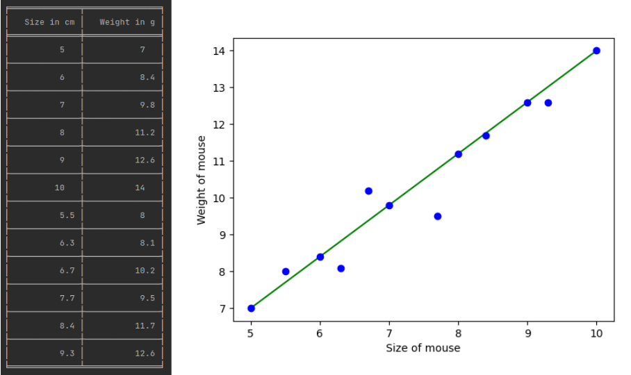

The table lists some of the data values. The goal of the algorithm is now to learn from this distribution in order to be able to classify new points.
We can observe from the plot, that there is a linear trend in the data.
The function which builds a link between the two variables is called the regression function.

# Mathematical formulation

Now a linear function is written as $ ŷ = w_{1}\cdot x + w_{0}$. In our case $ y $ would be the weight of the mice and $ x $ corresponds to the size.

### Miminizing error of prediction

- Our linear model is now:

$$
Ŷ(x) = ŷ = w_{0} + w_{1} \cdot x
$$

> 📔 **Note**: The ^ indicates that we predict the variable.

From the training set the algorithm knows some of the $ x $ and $ ŷ $ values. In order to find a function that fits all datapoints we need to approximate $ w_{0} $ and $ w_{1} $

</br>

- Which $ w_{0} $, $ w_{1} $ should we take? An infinite number of possible functions exist! So we take the values that minimize the error!
What does it look like?

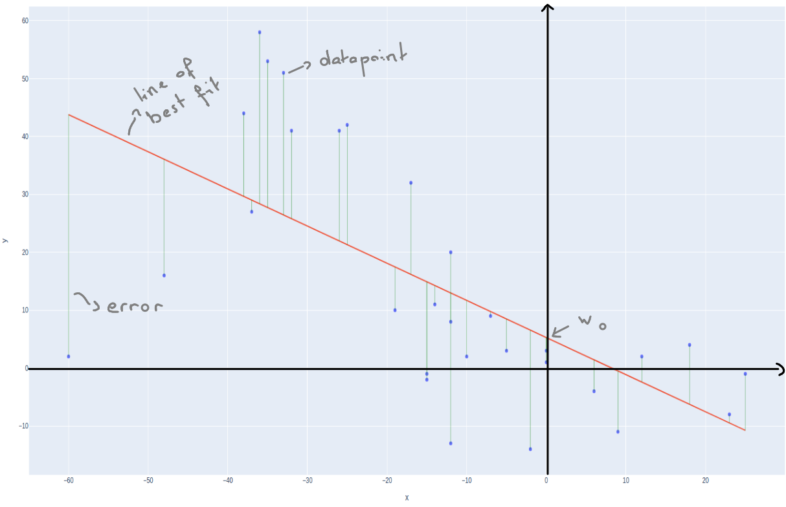

The error is represented by the green line. The bigger the distance of the line, the larger the error. So the best fitting function draws a red line that minimizes the green lines.

- The method used for this is called **the least squares** method. It minimizes the error function which describes the square of the distance between the datapoint and the fitting line. Since we look for a magnitude, we have to square the value:

$$
\mathrm{loss}(\hat{y}, y) = (\hat{y} - y)^2
$$

> 📔 **Note**: The difference between the actual value and the models estimate is called a **residual**


```py
from sklearn.metrics import mean_squared_error
  
Y = [0.5,1,3,2,4] 
Y_hat = [0.6,1.29,2.67,2.99,3.4]  
  
# Calculation of Mean Squared Error
mean_squared_error(Y,Y_hat)
```

Earlier we would have tried something like

$$
\min_{w_0, w_1} \mathbb{E} ~ \mathrm{loss}(\hat{Y}(X), Y) = \min_{w_0, w_1} \mathbb{E} ~ (w_0 + w_1 X - Y)^2
$$

but now we are in the realistic supervised learning mode so we cannot compute expectations. This is because we don't know the joint distribution of the samples and labels. Without it we cannot calculate an expectation value. In supervised learning we are dealing with the empirical error (the real error) and not with the predicted error.

- So we attempt to solve:

$$
min_{\ w_{0},w_{1}} \  \frac{1}{n} \sum_{i}^{n}(w_{0} + w_{1}x_{i} - y_{i})^2
$$

```python
from sklearn.linear_model import LinearRegression

n = 10
a = 1.0
b = 0.2
sig = 0.08
deg = n - 1

x = np.sort(np.random.rand(n, 1), axis=0)
y = a*x + b + sig*np.random.randn(n, 1)

fig, ax = plt.subplots(1, 1)
ax.scatter(x, y, color='g')

reg = LinearRegression().fit(x, y)
y_hat = reg.predict(x)

x_grid = np.linspace(0, 1, 200).reshape(-1, 1)
line, = ax.plot(x_grid, reg.predict(x_grid), 'k')

for i in range(n):
    plt.plot([x[i], x[i]], [y[i], y_hat[i]], 'y')
```

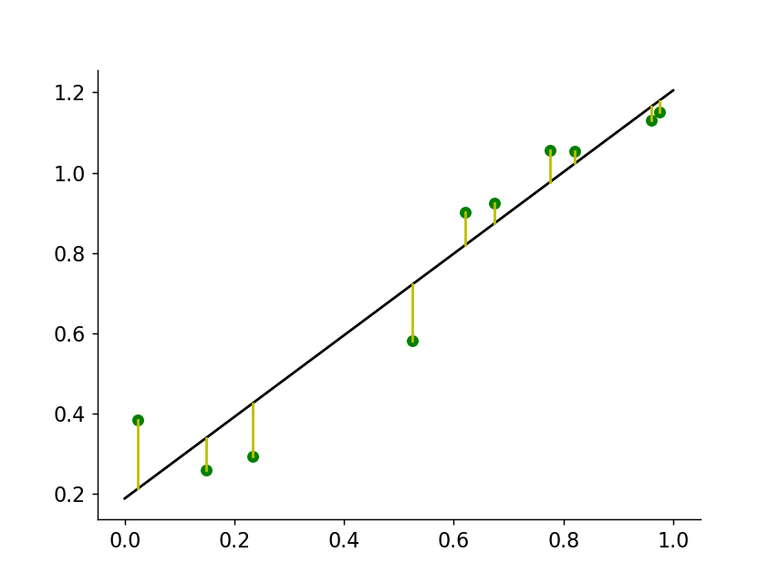

This was an example in one dimension. For the simple function $ y = ax + b $. Now we can apply the same procedure in higher dimensions. We then get a function like:

$$
ŷ = w_{0} + w_{1}x_{1} + ... + w_{n}x_{n}
$$

For two dimensions it would be:  $ ŷ = w_{0} + w_{1}x_{1} + w_{2}x_{2} $
So we don't use a line for the fitting, but a plane

This would then look something like this:

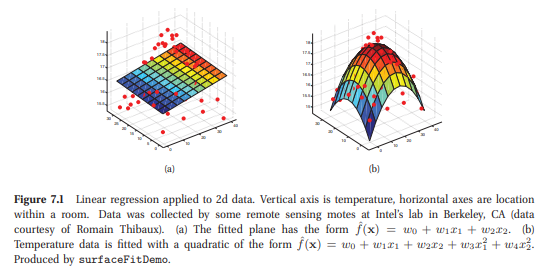

see @MurphyMachineLearning, pp. 218, chp. 7

Coding the error would be:

```py
# Snatched from: 

import matplotlib.pyplot as plt
import numpy as np
import sklearn.linear_model

from mpl_toolkits.mplot3d import Axes3D

X_train = np.random.rand(2000).reshape(1000,2)*10
y_train = ((X_train[:, 0]**5)+(X_train[:, 1]**5)) / 1e4
X_test = np.random.rand(200).reshape(100,2)*60
y_test = ((X_test[:, 0]**5)+(X_test[:, 1]**5)) / 1e4

fig = plt.figure()
ax = fig.add_subplot(111, projection='3d')
ax.scatter(X_train[:,0], X_train[:,1], y_train, marker='.', color='red')
ax.set_xlabel("$x_1$")
ax.set_ylabel("$x_2$")
ax.set_zlabel("$y$")

model = sklearn.linear_model.LinearRegression()
model.fit(X_train, y_train)
y_pred = model.predict(X_test)

print("MAE: {}".format(np.abs(y_test-y_pred).mean()))
print("RMSE: {}".format(np.sqrt(((y_test-y_pred)**2).mean())))

coefs = model.coef_
intercept = model.intercept_
xs = np.tile(np.arange(11), (11,1))
ys = np.tile(np.arange(11), (11,1)).T
zs = xs*coefs[0]+ys*coefs[1]+intercept
print("Equation: y = {:.2f} + {:.2f}x1 + {:.2f}x2".format(intercept, coefs[0],
                                                          coefs[1]))

ax.plot_surface(xs,ys,zs, alpha=0.5)
plt.show()
```


```python
MAE: 22995.110040883304
RMSE: 34665.4522791148
Equation: y = -3.47 + 0.64x1 + 0.72x2
```

Graphical Interpretation for the $ n = 3$, $ d = 2 $ example:
We have more examples than features (n > d), we get a subspace that is spanned as a plane. And a vector which points somewhere in $ \mathbb{R}^3 $. Our goal is to find a vector $ ŷ \in \mathbb{R}^N $ which is as close as possible to the real value.

In order to get the minimal distance between the plane and our datapoint, we obtain a orthogonal projection of $ y $ onto the plane. This projection corresponds to $ ŷ $.

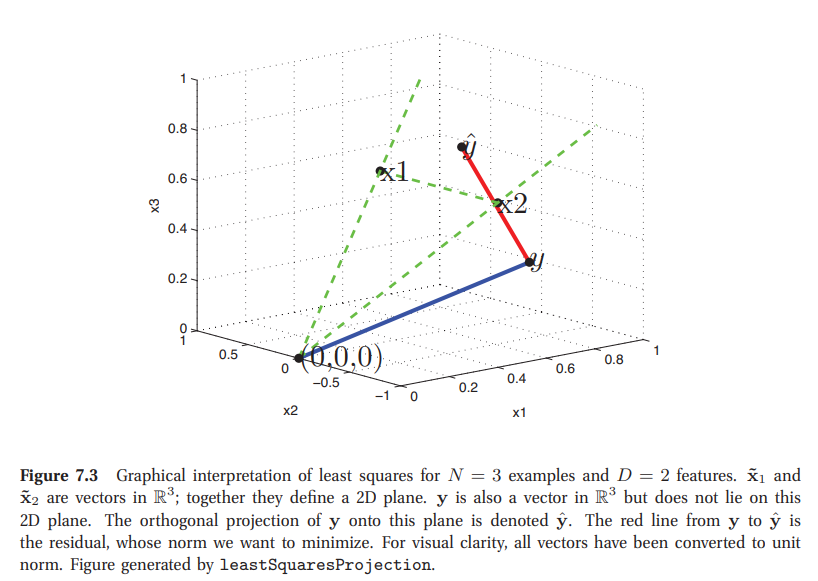

see Projection of least squares, Murphy Machine Learning, chp 7 pp.221

> 📔 **Note**: **MAE** is the mean absolute error (the residual is not squared) and **RMSE** is the root mean squared error.

**Recap: linear regression and least squares**

   We worked hard to find a formula for the "best **w**! The name of the game is to rewrite everything in terms of vectors and matrices. This gives us a general formula for all possible dimensions.

$$
\sum_{i = 1}^n (y_i - (w_0 + w_1 \cdot x_i))^2 
    = 
    \sum_{i = 1}^n \left(y_i - [1 \quad x_i] \begin{bmatrix}w_0 \\ w_1\end{bmatrix}\right)^2 
    =
    \left\|
    ~
    \begin{bmatrix}
    y_1 \\ y_2 \\ \vdots \\ y_n
    \end{bmatrix}
    -
    \begin{bmatrix}
    1 & x_1 \\
    1 & x_2 \\
    \vdots & \vdots \\
    1 & x_n
    \end{bmatrix}
    \begin{bmatrix}
    w_0 \\ w_1
    \end{bmatrix}
    ~
    \right\|^2
    =
    \| \mathbf{y} - \mathbf{X} \mathbf{w} \|^2
$$

The resulting equation is also called the least squared residual. We passed from a scalar equation to a vector equation.

> 📔 **Note**: if $ (X_i,Y_i) ∼ iidP $, then by the law of large numbers
> 
> $$
\lim_{n \to \infty} \underbrace{\frac{1}{n} \sum_{i = 1}^n (Y_i - (w_0 + w_1 \cdot X_i))^2}_{\text{sample risk}} \to \underbrace{\mathbb{E} ~ (Y - (w_0 + w_1 \cdot X))^2}_{\text{population risk}}
$$


### Find optimal weights for the function

We want to find the best weights that minimize the loss which we call $ \mathbf{w}^\star $

$$
\mathbf{w}^\star = \arg\min_{\mathbf{w}} \underbrace{\| \mathbf{y} - \mathbf{X} \mathbf{w} \|^2}_{= \text{loss} ~ \mathcal{L}(\mathbf{w})}
$$

Now for the solution we proceed as usual: in order to find a minimum we calculate the partial derivatives with respect to the components of $ \mathbf{w} = [w_0, w_1,..., w_d] $ with $ d $ the number of dimensions.

It turns out:

$$
\nabla_\mathbf{w} \left( \| \mathbf{y} - \mathbf{X} \mathbf{w} \|^2 \right) = \frac{\partial \mathcal{L}(\mathbf{w})}{\partial \mathbf{w}} = \begin{bmatrix}\frac{\partial \mathcal{L}}{\partial w_0}\\ 
\frac{\partial \mathcal{L}}{\partial w_1} \\
\vdots \\
\frac{\partial \mathcal{L}}{\partial w_d}\end{bmatrix} = -2 \mathbf{X}^T(\mathbf{y} - \mathbf{X} \mathbf{w})
$$


> 🎯 **Result**: The optimal weights are now:
> 
> $$
-2 \mathbf{X}^T(\mathbf{y} - \mathbf{X} \mathbf{w}) = \mathbf{0} \Rightarrow \mathbf{w}^\star = (\mathbf{X}^T \mathbf{X})^{-1} \mathbf{X}^T \mathbf{y}
$$

**Higher dimension:**

- In "real" Pattern Recognition (so all around us) we more or less never have simple scalar patterns / features $ x_i \in \mathbb{R} $
- Pictures, environnement... All is in high dimension. In digit classification we had vector features $ \mathbf{x} \in \mathbb{R}^{284} $ or $ \mathbf{x} \in \mathbb{R}^{24 \times 24} $ (Number of pixels in an picture).
- The prediction is then (note the "1" for notational convenience):

$$
\hat{y} = w_0 + \sum_{i = 1}^d w_i x_i = [1, x_1, \ldots, x_d] \begin{bmatrix} w_0 \\
w_1 \\
\vdots \\
w_d \end{bmatrix} =: \mathbf{x}^T \mathbf{w}
$$

For a training set $(\mathbf{x}_1, y_1), \ldots, (\mathbf{x}_n, y_n) $ we can write as before

$$
\mathbf{y} =
    \begin{bmatrix}
    y_1 \\\\ y_2 \\\\ \vdots \\\\ y_n
    \end{bmatrix}
    \quad \quad
    \mathbf{X} =
    \begin{bmatrix}
    1 & -  \mathbf{x}_1^T - \\
    \vdots &   \vdots \\  
     \\
    1 & -  \mathbf{x}_n^T - \\
    \end{bmatrix}
    \quad \quad
    \mathbf{w} = \begin{bmatrix}
    w_0 \\
    \ w_1 \\
    \\ \vdots \\
    w_d
    \end{bmatrix}
$$

### An alternative derivation of weights

First note that a quadratic form may be expanded as

$$
\mathbf{a}^T \mathbf{Q} \mathbf{a} = \sum_{i = 1}^d \sum_{j = 1}^d a_i q_{ij}  a_j
$$

with some vector $ \mathbf{a} $ and some matrix $ \mathbf{Q} $
Now in order to get optimal weights we need to find the minimum. Again we will do it by taking the derivative:

Thus:

$$
\begin{aligned}
  \frac{\partial \mathbf{a}^T \mathbf{Q} \mathbf{a}}{\partial a_k}
  &= \sum_{j = 1}^d a_j q_{kj} + \sum_{i = 1}^d a_i q_{ik}  \\
  \\&= (\mathbf{Q} \mathbf{a})_k + (\mathbf{Q}^T \mathbf{a})_k
  \end{aligned}
$$

Collecting this for all $ {k} $ we get:

$$
\nabla_{\mathbf{a}} (\mathbf{a}^T \mathbf{Q} \mathbf{a})
    =
    \begin{bmatrix}
    \frac{\partial \mathbf{a}^T \mathbf{Q} \mathbf{a}}{\partial a_1} \\\\
    \frac{\partial \mathbf{a}^T \mathbf{Q} \mathbf{a}}{\partial a_2} \\\\ \vdots \\\\
    \frac{\partial \mathbf{a}^T \mathbf{Q} \mathbf{a}}{\partial a_d} \\\\
    \end{bmatrix} =
    \begin{bmatrix}
    (\mathbf{Q} \mathbf{a})_1 + (\mathbf{Q}^T \mathbf{a})_1 \\\\
    (\mathbf{Q} \mathbf{a})_2 + (\mathbf{Q}^T \mathbf{a})_2 \\\\
    \vdots \\\\
    (\mathbf{Q} \mathbf{a})_d + (\mathbf{Q}^T \mathbf{a})_d \\\\
    \end{bmatrix} =
    \mathbf{Q} \mathbf{a} + \mathbf{Q}^T \mathbf{a}
$$

Now we apply this formula to our loss function $ \| \mathbf{y} - \mathbf{X} \mathbf{w} \|^2 $:

- We first expand using the fact that $ \| \mathbf{x} \|^2 = \mathbf{x}^T\mathbf{x} $:

$$
\| \mathbf{X} \mathbf{w} - \mathbf{y} \|^2 = (\mathbf{X} \mathbf{w} - \mathbf{y})^T(\mathbf{X} \mathbf{w} - \mathbf{y}) = \mathbf{w}^T \mathbf{X}^T \mathbf{X} \mathbf{w} - 2 \mathbf{w}^T (\mathbf{X}^T \mathbf{y}) + \mathbf{y}^T \mathbf{y}
$$

- Now we differentiate term by term. We first apply the rule derived on the previous slide: $ \frac{\partial \mathbf{a}^T \mathbf{Q} \mathbf{a}}{\partial a_k} = (\mathbf{Q} \mathbf{a})_k + (\mathbf{Q}^T \mathbf{a})_k $ :

$$
\frac{\partial \mathbf{w}^T \mathbf{X}^T \mathbf{X} \mathbf{w}}{\partial \mathbf{w}} = \mathbf{X}^T \mathbf{X} \mathbf{w} + (\mathbf{X}^T \mathbf{X})^T \mathbf{w}
    = 2 \mathbf{X}^T \mathbf{X} \mathbf{w}
$$

- For the second term we use the rule for differentiating linear functionals of $ \mathbf{w} $ which is very simple to derive:

$$
\frac{\partial \mathbf{w}^T (\mathbf{X}^T \mathbf{y})}{\partial \mathbf{w}} = \mathbf{X}^T \mathbf{y}
$$

- And finally for the third term, we have the derivative of a constant (wrt $ \mathbf{w} $) is zero:

$$
\frac{\partial \mathbf{y}^T \mathbf{y}}{\partial \mathbf{w}} = \mathbf{0}.
$$

- Putting things together we again get $\  \mathbf{X}^T \mathbf{X} \mathbf{w} = \mathbf{X}^T \mathbf{y}$

### Yet another perspective: Geometry

We can rewrite:

$$
\min \left \{ \| \mathbf{y} - \mathbf{X} \mathbf{w} \|^2 \mid \mathbf{w} \in \mathbb{R}^d \right\}
$$

as:

$$
\min \left\{ \| \mathbf{y} - \mathbf{v} \|^2 \mid \mathbf{v} = \mathbf{X} \mathbf{w}, \mathbf{w} \in \mathbb{R}^d \right\}
$$

if we ignore $ \mathbf{w} $ for the moment and only care about $ \mathbf{v} $, then we can also write:

$$
\min \left\{ \| \mathbf{y} - \mathbf{v} \|^2 \mid \mathbf{v} \in \mathrm{span} \{ \mathbf{x}^{(1)}, \ldots, \mathbf{x}^{(d)} \}\right\}
$$

where $ \{ \mathbf{x}^{(1)}, \ldots, \mathbf{x}^{(d)} \} $ are the columns of $ \mathbf{X} $.

So which vector $ \mathbf{v} \in \mathrm{span} \{ \mathbf{x}^{(1)}, \ldots, \mathbf{x}^{(d)} \} $ minimizes this distance? Consider a small example with $ d = 2, n = 3 $

```py
x1 = np.array([1, 1, 1])
x2 = np.array([1, -1, 1])
y = np.array([-3, 1, 2])

X = np.vstack((x1, x2)).T
w = np.linalg.solve(X.T @ X, X.T @ y)
y_hat = X @ w

fig = plt.figure()
ax = fig.add_subplot(111, projection='3d')

xx, yy = np.meshgrid(range(-3, 4), range(-3, 4))
zz = xx

ax.quiver(
        0, 0, 0,
        x1[0], x1[1], x1[2],
        color='k', alpha = .8, lw = 1,
    )
ax.quiver(
        0, 0, 0,
        x2[0], x2[1], x2[2],
        color='k', alpha=.8, lw=1,
    )
ax.quiver(
        0, 0, 0,
        y[0], y[1], y[2],
        color='green', alpha=.8, lw=3,
    )
ax.quiver(
        0, 0, 0,
        y_hat[0], y_hat[1], y_hat[2],
        color='green', alpha=.8, lw=3,
    )
ax.plot([y[0], y_hat[0]], [y[1], y_hat[1]], [y[2], y_hat[2]], 'g:')
ax.plot_surface(xx, yy, zz, alpha=0.5)

ax.text(*(x1 + 0.2), '$x^{(1)} = [1, 1, 1]^T$')
ax.text(*(x2 + 0.2), '$x^{(2)} = [1, -1, 1]^T$')
ax.text(*(y + 0.2), '$y = [-3, 1, 2]^T$')
ax.text(*(y_hat + 0.2), '$\widehat{y}$')
ax.axis(False)
```

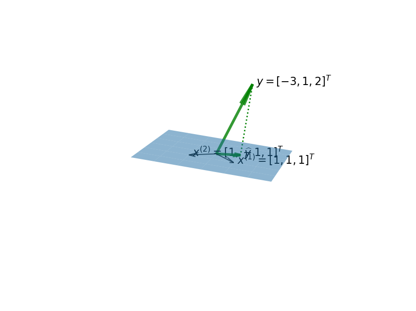

As in Murphys Machine Learning we get again an example of Least squares projection (dotted line), this time with the output:

` (-3.3, 3.3, -3.3, 3.3)`

- So again the shortest residual $ \mathbf{ŷ - y} $ (the one with the smallest norm) is perpendicular to the plane, and in particular to $ \mathbf{x^{(1)}} $ and $ \mathbf{x^{(2)}} $

1) For general $ d $, $ \mathbf{ŷ - y} $ is perpendicular to every column of $ \mathbf{X} $, (which means that the scalar product is $ 0 $):

$$
(\mathbf{x}^{(j)})^T (\hat{\mathbf{y}} - \mathbf{y}) = (\mathbf{x}^{(1)})^T (\mathbf{X} \mathbf{w} - \mathbf{y}) = 0 \quad \text{for} \quad j = 1, 2, \ldots, d + 1
$$

2) Writing this for every $ j $ gives:

$$
\left[\begin{array}{cc} - & (\mathbf{x}^{(1)})^T & -  \\\\ - & (\mathbf{x}^{(2)})^T & - \\ 
\vdots \\ - & (\mathbf{x}^{(d + 1)})^T & - \end{array} \right] (\mathbf{X} \mathbf{w} - \mathbf{y}) = \mathbf{0}
$$

3) Now we recall that:

$$
\mathbf{X} = \begin{bmatrix} | & \cdots & |\\\\ \mathbf{x}^{(1)} & \cdots & \mathbf{x}^{(d+1)}\\\\| & \cdots & |\end{bmatrix}
$$

4) So that finally we again get:

$$
\mathbf{X}^T \mathbf{X} \mathbf{w} = \mathbf{X}^T \mathbf{y}
$$

### **Example with a bit of fun:**

For fun let us apply linear regression to a problem which is utterly non-linear: digit classification.

#### **Least squares method:**

The idea is as follows: we will encode labels simply as $ y \in \{0, 1,...,9\} $ and treat them as real numbers.

We will compute the estimate as

$$
\mathbf{ŷ} = \text{round}(\text{vec}(\mathbf{x})^T\mathbf{w}))
$$

and the weights $ \mathbf{w} $ using the least squares procedure described above.

```py
from mlxtend.data import loadlocal_mnist

X_train, y_train = loadlocal_mnist(
        images_path='/Users/dokman0000/Downloads/train-images-idx3-ubyte', 
        labels_path='/Users/dokman0000/Downloads/train-labels-idx1-ubyte'
        )

d = 28**2
n = 50000

# sample n digits from the big training set
shuffle_idx = np.random.choice(X_train.shape[0], n)
X_train = X_train[shuffle_idx]
y_train = y_train[shuffle_idx]
```

```py
# remove pixels that are always zero
nz_mask = np.any(X_train > 0, axis=0)
X_mask = X_train[:, nz_mask] / 255.0
d_mask = nz_mask.sum()

# compute the weights
lam = 0.1
w_mask = np.linalg.inv(X_mask.T @ X_mask + lam * np.eye(d_mask)) @ X_mask.T @ y_train
relerr = (np.round(X_mask @ w_mask) != y_train).sum() / n
print('The relative training error is %3.0f%%' % (100*relerr) )
```

`The relative training error is  75%`

```py
# we can show the weights as an image... 

w = np.zeros((d,))
w[nz_mask] = w_mask
fig, ax = plt.subplots(1, 1)
ax.imshow(w.reshape(28, 28))
```

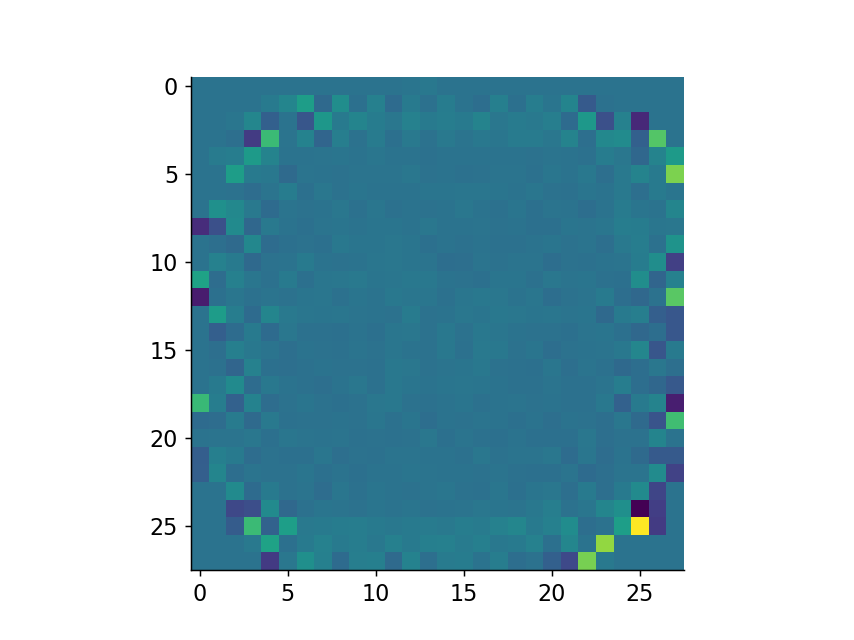

A relative training error of $ 75\% $ is not really what we are dreaming about.
Let's try to improve the result a bit with one-hot encoding...

Now we can perform our predictions:

#### **Label encoding**:

> 📜 "In label encoding in Python, we replace the categorical value with a numeric value between 0 and the number of classes minus 1. If the categorical variable value contains 5 distinct classes, we use (0, 1, 2, 3, and 4)."
> [1]

1) The first step consist in building the one-hot encoding matrix. This is necessary since the algorithm can't classify the features directly. That's why we attribute a binary vector for each x-variable. (Which gives us a matrix for all $ \mathbf{X} $).

If the first feature is a $ 8 $ we build a vector with the eight index as a $ 1 $ and the rest as $ 0 $ and so on.

```py
y_onehot = np.zeros((n, 10))
for i in range(n):
    y_onehot[i, int(y_train[i])] = 1


# y_onehot[y_onehot == 0] = -1

print(y_train[:5])  
print(y_onehot[:5, :])
```

As output for the one hot encoding we get:
`[8 4 9 0 8]`
For our features and

```py
[[0. 0. 0. 0. 0. 0. 0. 0. 1. 0.]
 [0. 0. 0. 0. 1. 0. 0. 0. 0. 0.]
 [0. 0. 0. 0. 0. 0. 0. 0. 0. 1.]
 [1. 0. 0. 0. 0. 0. 0. 0. 0. 0.]
 [0. 0. 0. 0. 0. 0. 0. 0. 1. 0.]]
```

for our one-hot encoded matrix.

2. We can now calculate the relative training error:

```py
X_b = np.hstack((np.ones((n, 1)), X_mask))

lam = 0.1
W_mask = np.linalg.inv(X_b.T @ X_b + lam * np.eye(d_mask + 1)) @ X_b.T @ y_onehot
y_hat_onehot = np.argmax(X_b @ W_mask, axis=1)

relerr = (y_hat_onehot != y_train).sum() / n
print('The relative training error is %3.0f%%' % (100*relerr) )

# TODO: show test errors!
```

We get an error of:
`The relative training error is  14%`

The relative training error is dramatically reduced! Label encoding is a really helpfull method for optimizing the algorithm.


> 📔 **Note**: You will often hear ML researchers discuss which are the right features for the task.
> But this example shows that using the right label encoding can also have a dramatic effect!


# A probabilistic perspective on linear regression

### **Visual explanation**

In linear regression we assume (or hope) that the response $ Y $ is indeed obtained as a linear combination of the explanatory variables $ {x_{1},...,x_{n}} $ and a constant "variable" $ 1 $,

$$
Y = \mathbf{w}^T \mathbf{X} + \epsilon
$$

The noise or error $\epsilon$ that has been added is usually assumed Gaussian, $\epsilon \sim \mathcal{N}(\mu, \sigma^2)$ so that we can write

$$
p(y \mid \mathbf{x};  \mathbf{\theta}) = \mathcal{N}(y \mid  \mathbf{w}^T \mathbf{x}, \sigma^2)
$$

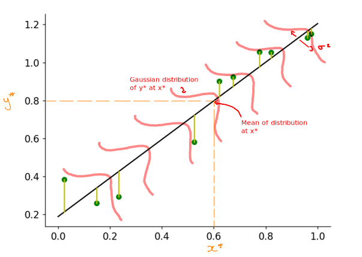

This means that our best fitting line represents the mean values of the gaussian distribution for the predictions. And so the predicted results are distributed around this line in a gaussian manner.

Let's explore it with a visual example:

```py
from sklearn.linear_model import LinearRegression

n = 10000
a = 1.0
b = 0.2
sig = 0.08
deg = n - 1

x = np.random.rand(n, 1)
x = np.sort(x, axis=0)
y = a*x + b + sig*np.random.randn(n, 1)

fig, axs = plt.subplots(1, 2, figsize=(10, 4))
axs[0].scatter(x, y, color='g', marker='.', alpha=0.1)
axs[0].set_xlabel('X')
axs[0].set_ylabel('Y')
axs[0].set_title('Draws from $\mathcal{N}(y | \mathbf{w}^T \mathbf{x}, \sigma^2)$')
   

reg = LinearRegression().fit(x, y)
x_grid = np.linspace(0, 1, 200).reshape(-1, 1)

line, = axs[0].plot([],[], 'k')
line.set_xdata(x_grid)
line.set_ydata(reg.predict(x_grid))

axs[1].hexbin(x.flatten(), y.flatten(), gridsize=32)
axs[1].set_xlabel('X')
axs[1].set_ylabel('Y')
axs[1].set_title('Histogram of $\mathcal{D}$')
```

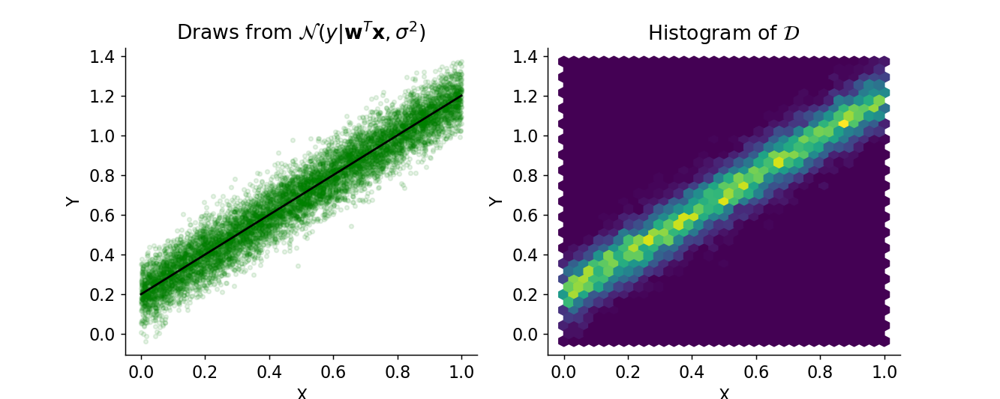

Text(0.5, 1.0, 'Histogram of $\mathcal{D}$')

Where the colors represent the height of the distribution (yellow high to blue low).

Or in 3D:

```py
from mpl_toolkits.mplot3d import Axes3D
from matplotlib import cm

x_ = np.linspace(0, 1.0, 200)
y_ = np.linspace(0, 1.5, 200)
xx, yy = np.meshgrid(x_, y_)
zz = 1 / sig / np.sqrt(2*np.pi) * np.exp(-(a * xx + b - yy)**2 / 2 / sig**2)

fig = plt.figure()
ax = plt.axes(projection='3d')
ax.plot_surface(xx, yy, zz, cmap=cm.coolwarm,  rcount=100, ccount=100)
```

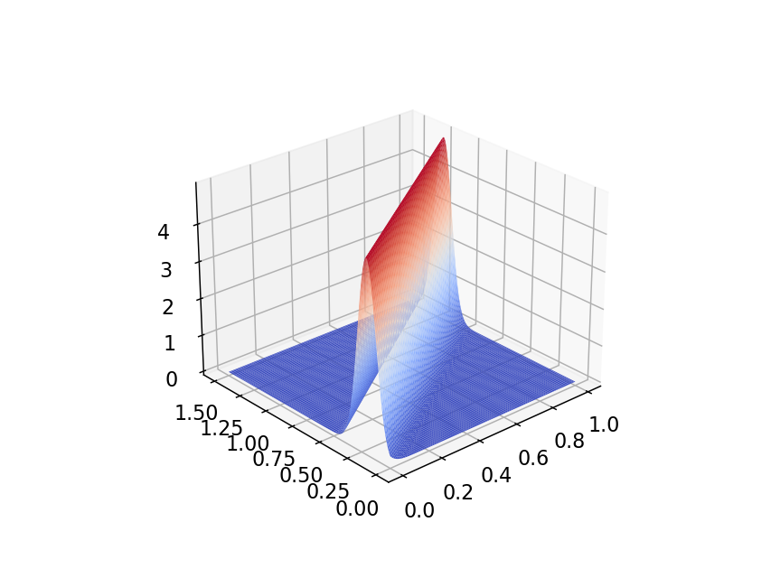

Here our best fitting line would pass through the middle of the "tunnel"...

### **2) Statistically optimal parameters: Maximum likelihood**

Our goal is now to find values for the parameter $ \theta $ (in our case the weights and the variance) that minimizes the error, which is the difference between our predicted point and the real datapoint. (see figure)
<br></br>

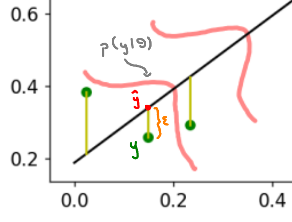

What we do is to:

> 📜 "Maximize the chance of seeing data given a certain value of $\theta$." [2](https://www.nural.cc/intro-to-ml3/)

This is the definition of the **_likelihood_**!
In order to find the best $\theta$ we have to maximize the likelihood. This process is called the Maximum likelihood estimation MLE.

We will go through these calculations step by step:

1. We model the training set $\mathcal{D} = \{ (\mathbf{x}_i, \mathbf{y_i}) \}_{i=1}^n$ as independent, identically distributied random draws (copies)
2. We can thus compute the probability (likelihood) of observing a given training set $p(\mathcal{D}; \theta)$ if we believe that the data is generated by a linear regression model with parameters $\theta = (\mathbf{w},\sigma)$. It is then appealing to estimate $\theta$ such that it maximizes the likelihood of observing $\mathcal{D}$:

$$
\hat{\theta} = \arg\max_{\theta} p(\mathcal{D} ; \theta) = \arg\max_\theta \prod_{i = 1}^n p(y_i | \mathbf{x}_i; \theta)
$$

3. We define the log-likelihood which is a function of θ rather than D:

$$
\ell(\theta) := \log p(\mathcal{D}; \theta) = \sum_{i = 1}^n \log p(y_i | \mathbf{x}_i ; \theta)
$$

> 🤔 **Note**: Why the logarithm?
> 
> We do this because if is earsier to calculate the derivative of a sum than of a product and the log of a product gives us a sum... + it is numerically more stable since the likelihood values could be very small and vanish, a problem that can be solved by taking the logarithm


4. Maximizing the log-likelihood is equivalent to minimizing the negative log-likelihood (NLL):

$$
\mathrm{NLL}(\theta) := - \ell(\theta) = -  \sum_{i = 1}^n \log p(y_i | \mathbf{x}_i ; \theta)
$$

5. Apply it to our model of linear regression:

$$
\begin{aligned} \ell(\theta) = \sum_{i = 1}^n \log \left[ \frac{1}{\sigma \sqrt{2 \pi}} \exp \left( -\frac{1}{2\sigma^2}(y_i - \mathbf{w}^T \mathbf{x}_i)^2 \right) \right] \\
=- \frac{1}{2 \sigma^2} \underbrace{\sum_{i = 1}^n (y_i - \mathbf{w}^T \mathbf{x}_i)^2}_{\text{residual sum of squares}~\mathrm{RSS}(\mathbf{w})} - \frac{n}{2} \log(2\pi\sigma^2) \end{aligned}
$$

Note that since our underlying functional model is $Y = \mathbf{w}^T \mathbf{X} + \epsilon$, we have that

$$
\mathrm{RSS}(\mathbf{w}) = \sum_{i = 1}^n (y_i - \mathbf{w}^T \mathbf{x}_i)^2= \| \boldsymbol{\epsilon} \|^2 = \sum_{i = 1}^n \epsilon_i^2
$$

So the difference between our prediction and the correct solution equals the noise...

-> Simple mathematical magic! 😉

## **Limitations of simple linear regression and outlook**

- So far our predictors could only look like lines, etc so most of the time it will not give us good results
- It is highly sensitiv to outliers (for example a mouse with a size of $ 6cm $ and a weight of $ 30g$).
- It makes the assumption of independency of the data which is not always true. (For example: mice which we found in the city might generally be heavier than mice from the country)
- It tends to overfit the data by taking into account to much detail from the learning model.

So linear regression tends to oversimplify real life data.
Now how can we improve the algorithm?

- In order to capture more than only linear functions we will learn something that is called logistic regression...
- And we will use so called kernels. This allows us to apply linear classifiers to non-linear problems by changing to a higher dimension. $\\$
  Let's try this rather cracy idea:

$$
\phi(x; \omega) = \cos(\omega x)
$$

Let's go towards kernel methods!

```py
x = np.random.rand(100)
y = np.random.rand(102)

A = np.random.rand(3)

for i in range(100 - 2):
# TODO
```


